# Running the GOMA pipeline

GOMA (Galaxy Open-source *Mycobacterium tuberbulosis* Analysis) is a pipeline designed to analyse Illumina WGS data of clinical *Mtb* strains. It is able to determine variants, lineage and sub-lineage, detect drug-resistance, identify transmission clusters and create phylogenies. GOMA is built on the [EU Galaxy platform](https://usegalaxy.eu/), free to use and fully customizable. 

Following is a tutorial on how to run the pipeline succesfully. It starts with the prerequisits, covers data preparation, how to get the accessory files and finishes with how to run the pipeline.

## Prerequisits

To use the pipeline the user needs to:

- Have an account on [galaxy.eu](https://usegalaxy.eu/) - [Log in or register](https://live.usegalaxy.eu/login/start?redirect=None).
- Have the sequencing data in fastq.gz format either locally- or cloud-stored.
- Know the format of the sequencing data: 
    - SE (single-end), PE (paired-end), or SE and PE (both mixed).

## Data preparation

The GOMA pipeline requires the sequencing data to be in a certain format and structure.

### Uploading data to Galaxy
1. Create a new history by clicking on the plus symbol.
    

        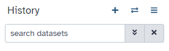
    

2.  Upload the FASTQ files from either local- or cloud-storage via the "Upload" tool on the top left side of the Galaxy GUI.

=== "Upload from local storage"

    

        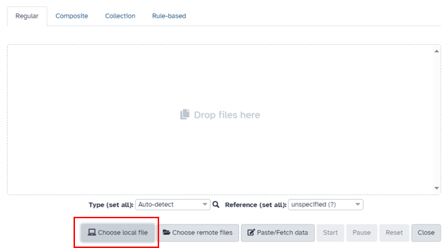
    

=== "Upload from cloud storage"

    

        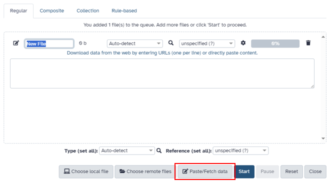
    

    Copy the links (URL) from the shared data library or directly paste the content.

### Concatenating data
If the dataset contains samples with multiple FASTQ files per sample for SE data and/or multiple pairs of FASTQ files for PE data, the files must be concatenated to proceed. 

=== "Many SE FASTQ files for one sample"

    

        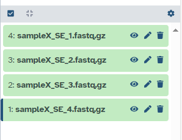
    

    Example nomenclature: sampleX_SE_1 means sample X single end data run/lane 1.
=== "Many PE FASTQ files for one sample"

    

        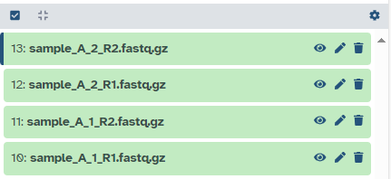
    

    Example nomenclature: sample_A_1_R1 means sample A run/lane 1 forward reads (R1).

Concatenating data can be done with the Galaxy tool "Concatenate datasets tail-to-head (cat)". We use this tool to concatenate (combine) all SE FASTQ files of a sample into one file. 

In the case of PE data, we concatenate all forward and all reverse FASTQ files (often marked with "R1" for forward and "R2" for reverse in the file name) into one forward and reverse FASTQ file respectively. 

=== "Concatenate SE FASTQ files"

    

        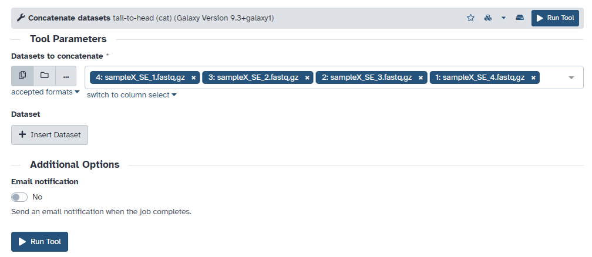
    

=== "Concatenate PE FASTQ files"

    

        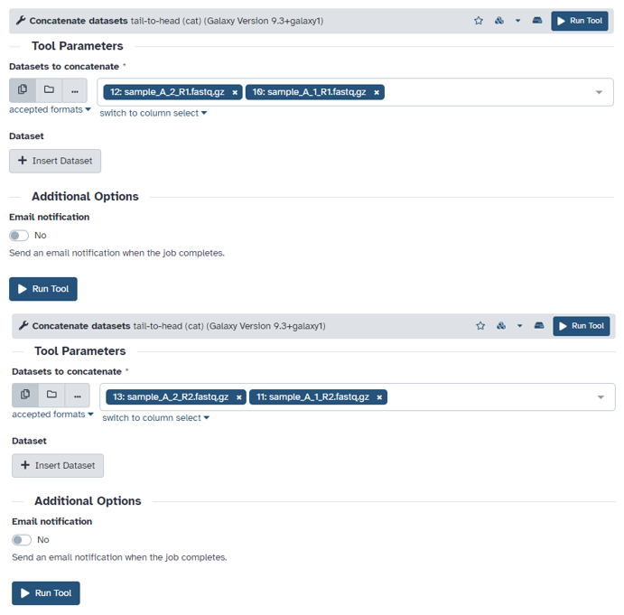
    

    First we concatenate all forward FASTQ files (R1) into one file, then we concatenate all reverse FASTQ files (R2) into one file.

We rename the resulting files according to our nomenclature.

=== "Concatenated SE FASTQ file"

    

        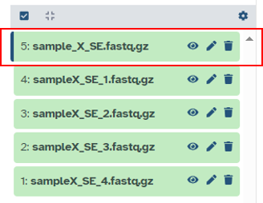
    

    "sample_X_SE.fastq.gz" now contains all data from the previous four FASTQ files.

=== "Concatenated PE FASTQ files"

    

        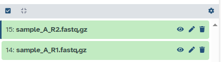
    

    "sample_A_R1.fastq.gz" now contains all forward reads from sample A, "sample_A_R2.fastq.gz" now contains all reverse reads from sample A.

### Building lists
If we have multiple samples, GOMA will process them in one run. To do this, the data needs to be organized in collections. For our SE data we build a list, for our PE data we build a list of dataset pairs. 

=== "Build list of SE datasets"

    

        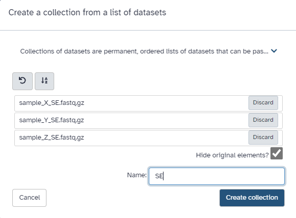
    

    Choose the tick box on the top of your history, choose all SE datasets, click on the "X of Y selected" dropdown menu and choose "Build Dataset List". Name the resulting list "SE".

=== "Build list of dataset pairs of PE data"

    

        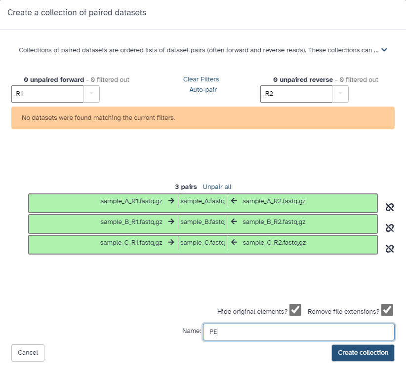
    

    Choose the tick box on the top of your history, choose all PE datasets (R1 and R2), click on the "X of Y selected" dropdown menu and choose "Build List of Dataset Pairs". Check if the right R1 and R2 datasets are paired (sample-wise) and name the resulting collection "PE".

Our data is now ready to be processed by GOMA.

## Accessory files
To perform the analysis, the GOMA pipeline needs a few accessory files that are provided on zenodo for the user. The dataset includes the reference genome, files for annotation and a VCF from *M.canettii* for rooting a phylogeny.

!!! note "Links to accessory files from Zenodo"
    https://zenodo.org/records/14536411/files/MTB_ancestor_reference_Chromosome.fasta 
    https://zenodo.org/records/14536411/files/genes_chromosome.gff3 
    https://zenodo.org/records/14536411/files/additional_annotations_chromosome.bed 
    https://zenodo.org/records/14536411/files/M.cannetti.vcf 

Use the paste/fetch data option from the "Upload" tool on Galaxy to import the files from zenodo into your history by copying the links above.

## Running the pipeline
To run the pipeline, navigate to the "Workflow" tab in your Galaxy top bar. Search for "GOMA pipeline". Three versions are available: One for only SE data, one for only PE data and one for both SE and PE data. Choose the version that fits your datatype(s).

The workflow can be imported to enable editing by the user and then being run or it can be run directly. 

    

Choose the right files and collections from your history. If it makes sense for your data and you wish to perform phylogenetic analysis and transmission cluster identification (they are linked together), enable the option "identify_transmission_links". The *M. cannetti* vcf input is optional and needs to be chosen when "identify_transmission_links" is enabled.

You can now run the workflow and track its progress with the "Workflow Invocations" tab on the left side of your Galaxy GUI.
